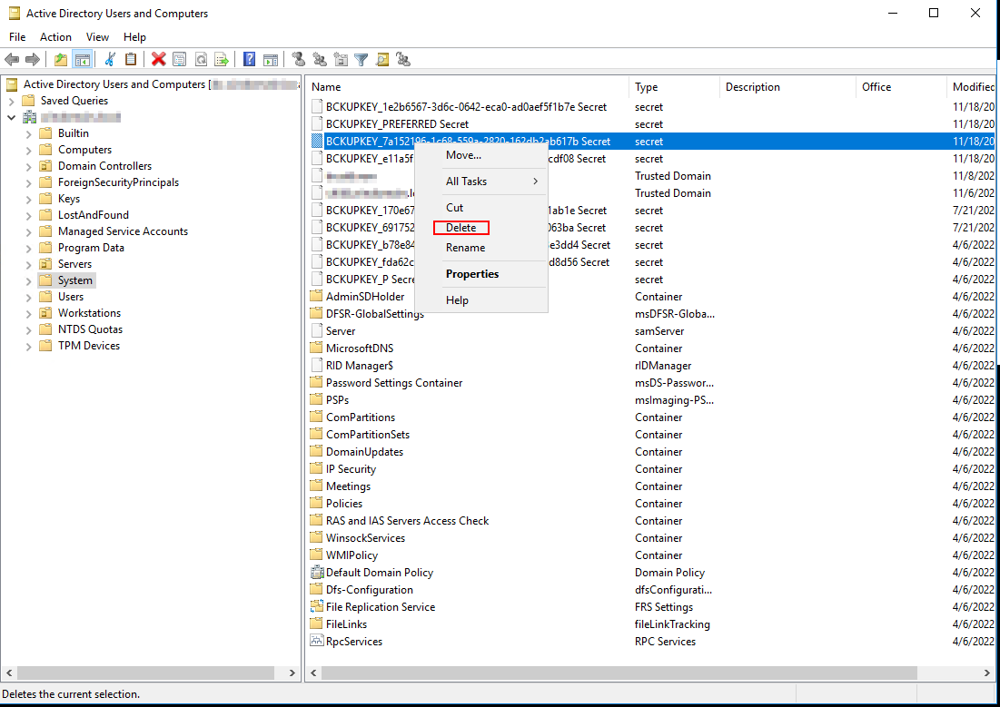

# DPAPI BackupKeyManager

## Overview

Data Protection API (DPAPI), is a widely used functionality within Windows applications to encrpyt sensitive data without taking care the encryption key and the algorithm themselves.<br />
Every Windows user has a Master Key (located in his profile path) that he uses to encrypt and decrypt data which can be stored locally or remotely.<br />
For Active Directory users, one copy of this Master Key is encrypted with the user's password and another copy is encrypted with the Domain BackupKey.
The second encrpytion was desgined to help users recover encrypted secrets in case they forget their own password.<br />
The Domain BackupKey is a unique RSA key pair generated during Active Directory domain inception.
Due to the fact that the BackupKey is permanent per domain, an exposure of this key provides an adversary with the ability to decrypt users' Master keys across the domain, indefinitely.<br />

The [BackupKeyManager]() is a tool to help organizations enhance their security on a post compromise scenario, where their DPAPI Domain BackupKey was exposed, and they wish to mitigate the risk of further exploitation with this key.
The process is simply done by generating a new BackupKey and onboard existing users' to backup their Master Keys with the new BackupKey.

For more information and the research behind this tool you can visit our blogpost -> [The downfall of DPAPI's top-secret weapon]()


## Usage

This repository contains two projects:
* BackupKeyManager - The main Backup Key modification tool (C#) + MS-BKRP DLL (C language)
* user-key-onboarding - A utility to onboard existing AD users to the domain backup key (PS)

### Flow to generate and prefer new DPAPI Backup key:

1. First, you will have to use the BackupKeyManager to extract the currently used (preferred) BackupKey. Write down its GUID in case you will need to revert back to it.
2. Use the BackupKeyManager to create and prefer a new backup key in the domain (Note to write down the generated GUID).
3. A restart will be required to the DC as we must reload the LSASS process.
4. Use the BackupKeyManager to validate that the certificate's GUID being served is identical to the one generated during step #1.
5. From a domain user session, execute the user-key-onboarding with either the soft or forced method. Note which user Master keys are using the new backup key ( By comparing their GUIDs).
6. Repeat step #4 for every user you would like to onboard to the new key.
> New Domain users will use the new key automatically.

## Listing

To list existing Backup keys, you may use the PS command below (ActiveDirectory module is required).
The result will include active directory secret objects that are related to the domain DPAPI functionality:
```
PS C:\> Get-ADObject -LDAPFilter "(objectClass=secret)" -Properties Name,whenCreated,whenChanged | FT Name,whenCreated, whenChanged

Name                                                 whenCreated           whenChanged
----                                                 -----------           -----------
BCKUPKEY_fda62c34-c58a-410e-8b49-3b11941d8d56 Secret 4/6/2022 8:45:19 AM   4/6/2022 8:45:19 AM    # Preferred Legacy backup key
BCKUPKEY_P Secret                                    4/6/2022 8:45:19 AM   4/6/2022 8:45:19 AM    
BCKUPKEY_b78e84e3-9105-439c-b0e3-94e3163e3dd4 Secret 4/6/2022 8:45:20 AM   4/6/2022 8:45:20 AM    # Preferred regular backup key
BCKUPKEY_PREFERRED Secret                            4/6/2022 8:45:20 AM   4/6/2022 8:45:20 AM
```
The *BCKUPKEY_P* content include *fda62c34-c58a-410e-8b49-3b11941d8d56* GUID which represents what object contains the Legacy preferred DPAPI backup key.
The *BCKUPKEY_PREFERRED* content include *1e2b6567-3d6c-0642-eca0-ad0aef5f1b7e* which represetns what object contains the regular preferred DPAPI backup key.<br>
This set of secret objects are created during the domain inception.


> The Legacy backup key is ignored in the BackupKeyManager project.


## BackupKeyManager

The BackupKeyManager 'help' provides information on what and how you can use it.
There are few verbs alongside with specific flags you can set according to your needs.
It is important to use this tool together with the Primary domain controller (PDC).

### Verbs required privileges
Domain Admin privileges required for:
- GetBackupKey
- SetPreferredBackupKey
- GenerateNewBackupKey (Only when using the push flag)
- BackupKeyFromFile (Only when using the push flag)
- Validate

Any Domain User privileges required for:
- GetPublicKey


### List verbs:

```
C:\BackupKeyManager>BackupKeyManager.exe --help
BackupKeyManager 1.0.0.0
Copyright c  2022

ERROR(S):
  No verb selected.

  GetPublicKey             Fetch the public certificate of the preferred BackupKey via MS-BKRP (Non-Admin operation).

  GetBackupKey             Get a BackupKey. By default will get the preferred (currently used) one.

  SetPreferredBackupKey    Set a new preferred BackupKey by providing its GUID

  GenerateNewBackupKey     Generate new BackupKey with option to push and set as preferred.

  BackupKeyFromFile        Load BackupKey from file with option to push and set as preferred.

  Validate                 Validates the BackupKey setup. Validation should be made against all DCs in the domain.

  help                     Display more information on a specific command.

  version                  Display version information.
```

### List specific verb's flags:

```
C:\BackupKeyManager>BackupKeyManager.exe GenerateNewBackupKey --help
BackupKeyManager 1.0.0.0
Copyright c  2022

  -d, --DomainName          Required. FQDN of the targeted domain. This will be included in the public certificate.

  -o                        (Optional) Flag to save the Backupkey and certificate (DER format) outputs to files in the
                            current path.

  --push                    (Optional) Push the generated BackupKey to a Domain Controller.

  -s, --DomainController    (Required with 'push') Primary Domain Controller FQDN to interact with.

  --set                     (Required with 'push') Set the generated BackupKey as the Preferred BackupKey.

  --help                    Display this help screen.

  --version                 Display version information.
```


### Get information about the currently active (preferred) BackupKey:
Extracts the preferred BackupKey via MS-LSAD protocol (Domain Admin is required). You may also specify alternative GUID to extract a different BackupKey contents.

```
C:\BackupKeyManager>BackupKeyManager.exe GetBackupKey -s dc.domain.local --analyze

[+] Setting up connection with Domain Controller: dc.domain.local
[+] Preferred backupkey Guid         : 170e6701-8213-48ce-bf52-1be5b6f1ab1e
[+] Getting backup key     : G$BCKUPKEY_170e6701-8213-48ce-bf52-1be5b6f1ab1e
[+] BackupKey size: 1952

[+] Validating BackupKey header...

[+] Analyzing certificate information:
[Certificate] Serial Number:     1E-AB-F1-B6-E5-1B-52-BF-48-CE-82-13-17-0E-67-01
[Certificate] Version:           3
[Certificate] Issuer name:       domain.local
[Certificate] Subject name:      domain.local
[Certificate] Not Before:        7/21/2022 1:33:28 PM +00:00
[Certificate] Not After:         7/21/2023 1:33:28 PM +00:00
[Certificate] Validity period:   365.00:00:00
[Certificate] SignatureAlgo OID: 1.3.14.3.2.29
[Certificate] PublicKeyInfo OID: 1.2.840.113549.1.1.1
[Certificate] RSA Key Size:      2048 bits
[Certificate] Certificate Guid:  170e6701-8213-48ce-bf52-1be5b6f1ab1e

[+] Validating Certificate format...

[+] Operation completed successfully!

```

### Generate new BackupKey and use it as the preferred BackupKey:

```
C:\BackupKeyManager>BackupKeyManager.exe GenerateNewBackupKey -d domain.local -s dc.domain.local --set --push

[+] Generated Guid: 1e2b6567-3d6c-0642-eca0-ad0aef5f1b7e

[+] Generating 2048 bit RSA Key pair...
[+] Creating certificate
[+] Building the new Domain BackupKey...
[+] BackupKey size: 1952

[+] Analyzing certificate information:
[Certificate] Serial Number:     7E-1B-5F-EF-0A-AD-A0-EC-06-42-3D-6C-1E-2B-65-67
[Certificate] Version:           3
[Certificate] Issuer name:       domain.local
[Certificate] Subject name:      domain.local
[Certificate] Not Before:        11/18/2022 5:39:16 AM +00:00
[Certificate] Not After:         11/18/2023 5:39:16 AM +00:00
[Certificate] Validity period:   365.00:00:00
[Certificate] SignatureAlgo OID: 1.3.14.3.2.29
[Certificate] PublicKeyInfo OID: 1.2.840.113549.1.1.1
[Certificate] RSA Key Size:      2048 bits
[Certificate] Certificate Guid:  1e2b6567-3d6c-0642-eca0-ad0aef5f1b7e

[+] Validating BackupKey header...

[+] Validating Certificate format...

[+] Setting up connection with Domain Controller: dc.domain.local
[+] Creating Backup key with name     : G$BCKUPKEY_1e2b6567-3d6c-0642-eca0-ad0aef5f1b7e
[+] New Backup key created successfully     : G$BCKUPKEY_1e2b6567-3d6c-0642-eca0-ad0aef5f1b7e
[+] Writing bytes to Backup key...
[+] Backup key uploaded successfully
[+] Modified preferred backup GUID to: 1e2b6567-3d6c-0642-eca0-ad0aef5f1b7e

[?] You must restart the targeted Domain Controller for the changes to take effect

[+] Operation completed successfully!
```

### Restart The targeted Domain Controller
Eventhough we set a different key as the preferred one, we must reload the LSASS process on the Domain Controller so it will serve the new public key to users in the domain.


###  Validate the BackupKey setup:
To make sure we did not break anything, we must validate the protocol functionality and keys synchronization.

```
C:\BackupKeyManager>BackupKeyManager.exe Validate -s dc.domain.local

[+] Setting up connection with Domain Controller: dc.domain.local
[+] Preferred Backupkey Guid         : 1e2b6567-3d6c-0642-eca0-ad0aef5f1b7e

[+] Retrieving the current BackupKey public certificate via MS-BKRP...OK -> Certificate size: 768
[+] MS-BKRP Serviced Backupkey Guid         : 1e2b6567-3d6c-0642-eca0-ad0aef5f1b7e

[+] SUCCESS! The serviced Backup Key (MS-BKRP) and the Preferred Backup key (MS-LSAD) are synced

[+] Validating MS-BKRP protocol health
    > Attempting secret encrypt (MySecret!).... OK
    > Attempting secret decrypt.... OK -> MySecret!

[+] SUCCESS! MS-BKRP secret encryption & decryption passed!

[+] Operation completed successfully!

```


### Get the currently served public backup key (Non-Admin) :
You may want to check what is served by the Domain Controller via the MS-BKRP protocol, and retreive informaton about the certificate

```
C:\BackupKeyManager>BackupKeyManager.exe GetPublicKey -s dc.domain.local --analyze

[+] Retrieving the current BackupKey public certificate via MS-BKRP...OK -> Certificate size: 768
[+] MS-BKRP Serviced Backupkey Guid         : 1e2b6567-3d6c-0642-eca0-ad0aef5f1b7e

[+] Analyzing certificate information:
[Certificate] Serial Number:     7E-1B-5F-EF-0A-AD-A0-EC-06-42-3D-6C-1E-2B-65-67
[Certificate] Version:           3
[Certificate] Issuer name:       domain.local
[Certificate] Subject name:      domain.local
[Certificate] Not Before:        11/18/2022 5:39:16 AM +00:00
[Certificate] Not After:         11/18/2023 5:39:16 AM +00:00
[Certificate] Validity period:   365.00:00:00
[Certificate] SignatureAlgo OID: 1.3.14.3.2.29
[Certificate] PublicKeyInfo OID: 1.2.840.113549.1.1.1
[Certificate] RSA Key Size:      2048 bits
[Certificate] Certificate Guid:  1e2b6567-3d6c-0642-eca0-ad0aef5f1b7e

[+] Validating Certificate format...

[+] Operation completed successfully!

```

## Delete a BackupKey (Not-Recommended)

> :warning: Although it is not required and does not pose a security risk to keep an older (or even compromised) one, some users may want to delete BackupKeys.
Keep in mind that deleting a BackupKey is **irreversible** and will disable users from restoring access to their sensitive information in case they forget their domain password.

On a Domain Controller, launch _dsa.msc_, make sure to enable system objects view by navigating to View -> Advanced Features.<br>
Double check the GUID of the BackupKey intended to be deleted, right click on it, delete and confirm:<br><br>
<center></center>


## Audit

While listing the existing BackupKeys once again, we will see added objects created later than *4/06/2022*. These objects are keys created using the BackupKeyManager.
Note the new modified time of the *BCKUPKEY_PREFERRED* object which is now pointing on *BCKUPKEY_1e2b6567-3d6c-0642-eca0-ad0aef5f1b7e*
```
PS C:\> Get-ADObject -LDAPFilter "(objectClass=secret)" -Properties Name,whenCreated,whenChanged | FT Name,whenCreated, whenChanged

Name                                                 whenCreated           whenChanged
----                                                 -----------           -----------
BCKUPKEY_fda62c34-c58a-410e-8b49-3b11941d8d56 Secret 4/6/2022 8:45:19 AM   4/6/2022 8:45:19 AM
BCKUPKEY_P Secret                                    4/6/2022 8:45:19 AM   4/6/2022 8:45:19 AM
BCKUPKEY_b78e84e3-9105-439c-b0e3-94e3163e3dd4 Secret 4/6/2022 8:45:20 AM   4/6/2022 8:45:20 AM
BCKUPKEY_PREFERRED Secret                            4/6/2022 8:45:20 AM   11/18/2022 5:39:16 AM 
BCKUPKEY_e11a5f54-1268-7521-3152-bb20845cdf08 Secret 11/18/2022 4:16:48 AM 11/18/2022 4:16:48 AM
BCKUPKEY_1e2b6567-3d6c-0642-eca0-ad0aef5f1b7e Secret 11/18/2022 5:39:16 AM 11/18/2022 5:39:16 AM   # New Preferred backup key
```

You can compare between the creation and modification dates of the *BCKUPKEY_PREFERRED* object in order to identify if there were any changes to the preferred BackupKey since the domain inception:
```
PS C:\> Get-ADObject -LDAPFilter "(cn=BCKUPKEY_PREFERRED Secret)" -Properties whenCreated,whenChanged | FT whenCreated,whenChanged

whenCreated         whenChanged
-----------         -----------
4/6/2022 8:45:20 AM 11/18/2022 5:39:16 AM
```


## user-key-onboarding

TBD


## Build

TBD